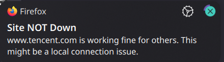

# site-status-checker
Simple Firefox Addon to tell you if a website is down for everyone or just you when you encounter connection errors
## Features

- Checks if a website is down for everyone or just you
- Provides notifications based on the status of the website

## Installation

1. Clone the repository:
    ```bash
    git clone https://github.com/solomons/site-status-checker.git
    ```
2. Navigate to the directory:
    ```bash
    cd site-status-checker
    ```
3. Follow the instructions in the `Install.md` file to add the addon to Firefox.

## Usage

When you encounter a connection error, the addon will automatically check the status of the website and provide a notification.

### Notifications

#### Site is down for everyone


#### Site is up for everyone but you

